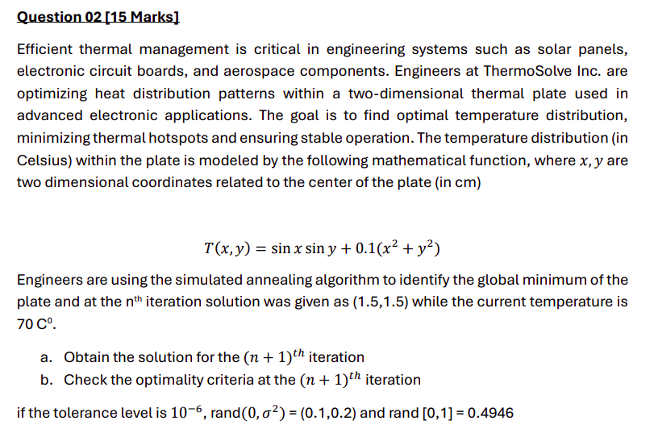

# Question 2

### Current Temperature value at $n^{th}$ iteration

$T(x_n,y_n) = sin(x_n)sin(y_n) + 0.1(x_n^2 + y_n^2)$  
$T(1.5, 1.5) = sin(1.5)sin(1.5) + 0.1(1.5^2 + 1.5^2)$  
$T(1.5, 1.5) = 1.445$

### Current Temperature value at $n+1^{th}$ iteration
#### Update the step size
$x_{n+1} = x_n + rand(0, \sigma^2)$  
$x_{n+1} = 1.5 + 0.1$  
$x_{n+1} = 1.6$

$y_{n+1} = y_n + rand(0, \sigma^2)$  
$y_{n+1} = 1.5 + 0.2$  
$y_{n+1} = 1.7$

$T(x_{n+1},y_{n+1}) = sin(x_{n+1})sin(y_{n+1}) + 0.1(x_{n+1}^2 + y_{n+1}^2)$  
$T(1.6, 1.7) = sin(1.6)sin(1.7) + 0.1(1.6^2 + 1.7^2)$  
$T(1.6, 1.7) = 1.536$

### Condition to Accept
Since, $T(x_{n+1},y_{n+1}) > T(x_n,y_n)$, we don't directly accept this. We need to calculate the probability to accep this.

$P_{n, n+1} = e ^ {\frac{- \Delta f}{T}}$  
$P_{n, n+1} = e ^ {\frac{f_{n} - f_{n+1}}{T}}$  
$P_{n, n+1} = e ^ {\frac{1.445 - 1.536}{70}}$  
$P_{n, n+1} = 0.9987$

$rand(0, 1) = 0.4946$  
If $P_{n, n+1} > rand(0,1)$, then accept the new step otherwise reject.

Since $P_{n, n+1} > rand(0,1)$, we will accept the $n+1^{th}$ step.

## NOTE
If we are accepting a new step, we should reduce the temperature by cooling rate $c$, to reduce the large jumps. 

$T_{new} = T_{old} * c$