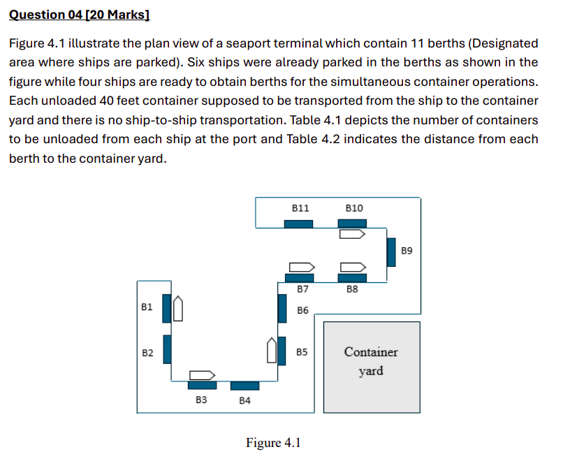
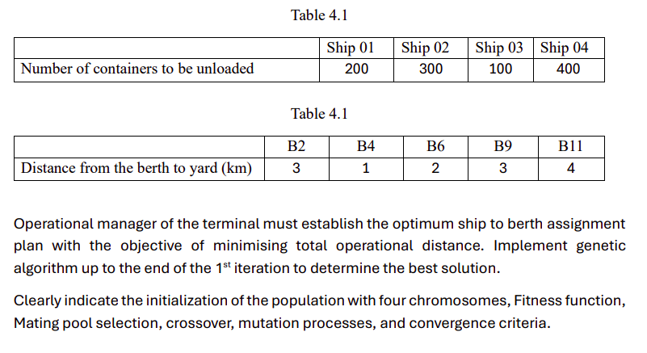

# Question 4

## Initialization

### Fitness Function
$f = \sum_{i=0}^{4} \sum_{j=0}^{5} D_{ij} \cdot x_{ij}$  
$D_{ij}=S_i * B_j$ 
$i \in \{1,4\}$ and $j \in \{2,4,6,9,11\}$

Since this is a minimization problem, let's define the fitness function like this,
$F_{new} = \frac{1}{1 + f} * 10^4$

### Total Distance Matrix

| Berth →   | B2 (×3) | B4 (×1) | B6 (×2) | B9 (×3) | B11 (×4) |
|-----------|--------|--------|--------|--------|--------|
| **Ship 01 (200)** | 600    | 200    | 400    | 600    | 800    |
| **Ship 02 (300)** | 900    | 300    | 600    | 900    | 1200   |
| **Ship 03 (100)** | 300    | 100    | 200    | 300    | 400    |
| **Ship 04 (400)** | 1200   | 400    | 800    | 1200   | 1600   |

### Population Assignment
For each ship, the berths are assigned and they are encoded. 

$Probability= \frac{Fit_k}{\sum_{k=0}^{4}Fit_{k}}$

$Genetic No = ROUND(Probability * Number of Chromosomes)$

<table>
  <tr>
    <th>Chromosome</th>
    <th>Initial Population</th>
    <th>Fitness Value (Fit_k)</th>
    <th>Probability</th>
    <th>Genetic No</th>
  </tr>
  <tr>
    <td>1</td>
    <td>{B2, B6, B9, B4}</td>
    <td>5.260</td>
    <td>0.310</td>
    <td>1</td>
  </tr>
  <tr>
    <td>2</td>
    <td>{B2, B6, B11, B4}</td>
    <td>4.998</td>
    <td>0.294</td>
    <td>1</td>
  </tr>
  <tr>
    <td>3</td>
    <td>{B2, B9, B6, B11}</td>
    <td>3.029</td>
    <td>0.178</td>
    <td>1</td>
  </tr>
  <tr>
    <td>4</td>
    <td>{B9, B2, B11, B6}</td>
    <td>3.702</td>
    <td>0.217</td>
    <td>1</td>
  </tr>
</table>

## Cross-over & Mutation

Get the first two chromosomes, and the last two chromosomes and cross over at a random point.

Cross over first 2 chromosomes at point 2 (This is randomly selected).  
First Child: {B2, B6, B11, B4} 
Second Child: {B2, B6, B9, B4} 

Now Mutate by swapping the elements or changing a gate to new gate. 

1. Swapping the elements 
First Child: {B4, B6, B11, B2} 
Second Child: {B2, B4, B9, B6} 

2. Chaning a Berth gate 
First Child: {B2, B9, B11, B4} 
Second Child: {B2, B6, B9, B11} 

Likewise do this for the other two parents get the new children. Hence this will be next generation. Go until the optimality criteria is met.

$|F_{n+1} - F_n| < \epsilon (threshold)$ 

Calculate the new fitness values and check for the optimal criteria. 

